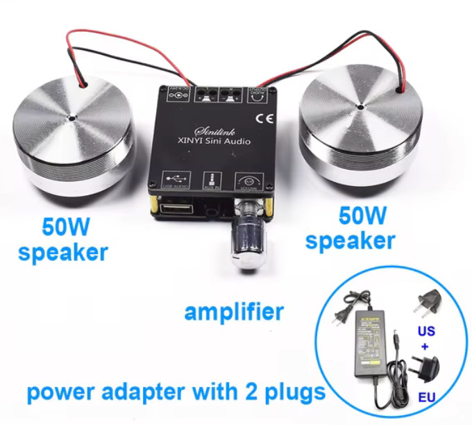

# *TableVibes* - Microscopy Table Vibration Transmission Analyser

Building advanced microscopy setups often begins with addressing vibration damping. Shipping optical tables to the global south can be a challenge, and it’s not always clear if expensive solutions are needed. Do passive damping systems suffice? What about active damping? The answer depends on the vibration levels in your specific lab environment. *TableVibes* offers a simple, low-cost way to measure vibration transmission, helping you assess whether high-end damping is necessary or if a simpler solution will work for your setup. This system uses a powerful surface speaker to simulate vibrations and pre-existing smartphone apps to analyze the frequency spectrum and amplitude transmission from the floor to the table and across different parts of the platform. Gather the data you need to make informed decisions, without the cost and complexity.

In order to measure even small transmission percentages, we start with a cheap (about 100$) but powerful surface speaker (100W) from AliExpress that can generate strong vibrations on different surfaces. We bought [this model](https://es.aliexpress.com/item/1005006213936265.html?spm=a2g0o.order_list.order_list_main.85.6083194dRhRy4s&gatewayAdapt=glo2esp) but similar devices are available on the market and should work the same. If you are in Santiago Chile, feel free to borrow it from us.

There are many phone apps avaialble to use the sufisticated sentitive sensors of the phone to measure vibrations. We removed the phone casing for this purpose to avoid loss of sensitivity and tried the following app(s):
* ...
